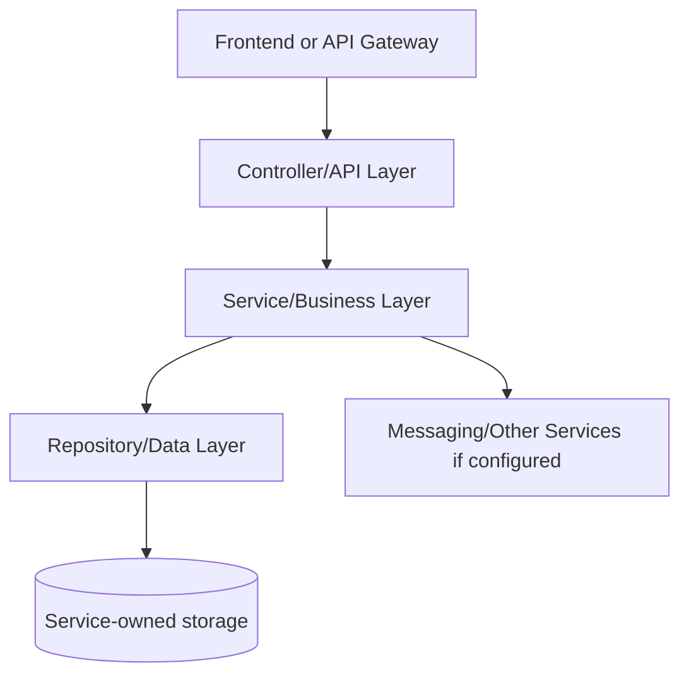
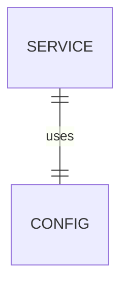

# ConnectSphere Web - SERVICE_DOCUMENTATION.md

## 1. Service Overview

**Service folder:** `connectsphere-web`  
**Type:** Angular frontend  
**Port:** 4200 local / 80 container / 8088 host in prod compose  
**Run command:** `cd connectsphere-web && npm start`

Browser application for social feed, auth, profiles, posts, stories, messages, notifications, and admin dashboards.

**Business responsibility:** UI rendering, routing, session state, JWT header injection, REST/WebSocket API calls.

**Data owned:** Client-side state only.

**Why this service exists:** In a microservices design, this responsibility changes independently from other domains. For interviews, explain that the service owns its data and exposes an API contract instead of letting other services touch its tables directly.

## 2. Service Architecture



**Internal structure:**

| Folder/File Area | Meaning |
| --- | --- |
| `src/main/java/.../controller` | HTTP boundary and exception mapping. |
| `src/main/java/.../service` | Business rules, transactions, orchestration. |
| `src/main/java/.../repository` | Spring Data persistence/search queries. |
| `src/main/java/.../entity` | Database table mapping. |
| `src/main/java/.../dto` | Request and response contracts. |
| `src/main/java/.../config` | Beans, OpenAPI, security, messaging, storage, or websocket setup. |
| `src/main/resources` | Runtime configuration with environment overrides. |
| `src/test` | Integration/unit tests proving important flows. |

**Request flow:** request enters controller, request DTO validation runs, service performs business checks, repository persists/queries data, response DTO returns to API Gateway/front-end.

## 3. File-by-File Explanation

| File Path | Purpose | What It Does | Connected With | Interview Notes |
| --- | --- | --- | --- | --- |
| connectsphere-web/.editorconfig | Configuration class: declares beans, security, OpenAPI, messaging, storage, or websocket setup. | Configuration class: declares beans, security, OpenAPI, messaging, storage, or websocket setup. | Related module build/runtime | Explain how Angular component/page/core layers connect UI interactions to REST/WebSocket calls. |
| connectsphere-web/.gitignore | Project source/configuration file used by this module. | Project source/configuration file used by this module. | Related module build/runtime | Explain how Angular component/page/core layers connect UI interactions to REST/WebSocket calls. |
| connectsphere-web/.prettierrc | Project source/configuration file used by this module. | Project source/configuration file used by this module. | Related module build/runtime | Explain how Angular component/page/core layers connect UI interactions to REST/WebSocket calls. |
| connectsphere-web/Dockerfile | Container build recipe used by Docker Compose and Jenkins deployment. | Container build recipe used by Docker Compose and Jenkins deployment. | Related module build/runtime | Explain multi-stage/image build and why containerized services are portable. |
| connectsphere-web/README.md | Markdown documentation/readme file. | Markdown documentation/readme file. | Related module build/runtime | Explain how Angular component/page/core layers connect UI interactions to REST/WebSocket calls. |
| connectsphere-web/angular.json | JSON configuration or data file. | JSON configuration or data file. | Related module build/runtime | Explain how Angular component/page/core layers connect UI interactions to REST/WebSocket calls. |
| connectsphere-web/docker/nginx/default.conf | Nginx configuration for reverse proxy and TLS routing. | Nginx configuration for reverse proxy and TLS routing. | Related module build/runtime | Explain how Angular component/page/core layers connect UI interactions to REST/WebSocket calls. |
| connectsphere-web/package-lock.json | npm lockfile: pins exact dependency tree for reproducible frontend installs. | npm lockfile: pins exact dependency tree for reproducible frontend installs. | Related module build/runtime | Explain how Angular component/page/core layers connect UI interactions to REST/WebSocket calls. |
| connectsphere-web/package.json | npm project descriptor: declares Angular scripts and frontend dependencies. | npm project descriptor: declares Angular scripts and frontend dependencies. | Angular CLI, npm, Docker frontend build | Explain how Angular component/page/core layers connect UI interactions to REST/WebSocket calls. |
| connectsphere-web/public/favicon.ico | Project source/configuration file used by this module. | Project source/configuration file used by this module. | Related module build/runtime | Explain how Angular component/page/core layers connect UI interactions to REST/WebSocket calls. |
| connectsphere-web/src/app/app.config.ts | Configuration class: declares beans, security, OpenAPI, messaging, storage, or websocket setup. | Configuration class: declares beans, security, OpenAPI, messaging, storage, or websocket setup. | Related module build/runtime | Explain how Angular component/page/core layers connect UI interactions to REST/WebSocket calls. |
| connectsphere-web/src/app/app.html | Template file: declares the rendered UI markup for an Angular component/page. | Template file: declares the rendered UI markup for an Angular component/page. | Related module build/runtime | Explain how Angular component/page/core layers connect UI interactions to REST/WebSocket calls. |
| connectsphere-web/src/app/app.routes.ts | TypeScript source: Angular component, route, model, guard, interceptor, or helper. | TypeScript source: Angular component, route, model, guard, interceptor, or helper. | Related module build/runtime | Explain how Angular component/page/core layers connect UI interactions to REST/WebSocket calls. |
| connectsphere-web/src/app/app.scss | Stylesheet file: component/page styling, layout, responsive behavior, and visual polish. | Stylesheet file: component/page styling, layout, responsive behavior, and visual polish. | Related module build/runtime | Explain how Angular component/page/core layers connect UI interactions to REST/WebSocket calls. |
| connectsphere-web/src/app/app.spec.ts | TypeScript source: Angular component, route, model, guard, interceptor, or helper. | TypeScript source: Angular component, route, model, guard, interceptor, or helper. | Related module build/runtime | Explain how Angular component/page/core layers connect UI interactions to REST/WebSocket calls. |
| connectsphere-web/src/app/app.ts | TypeScript source: Angular component, route, model, guard, interceptor, or helper. | TypeScript source: Angular component, route, model, guard, interceptor, or helper. | Related module build/runtime | Explain how Angular component/page/core layers connect UI interactions to REST/WebSocket calls. |
| connectsphere-web/src/app/components/auth-modal/auth-modal.html | Template file: declares the rendered UI markup for an Angular component/page. | Template file: declares the rendered UI markup for an Angular component/page. | Pages and shared UI shell | Explain how Angular component/page/core layers connect UI interactions to REST/WebSocket calls. |
| connectsphere-web/src/app/components/auth-modal/auth-modal.scss | Stylesheet file: component/page styling, layout, responsive behavior, and visual polish. | Stylesheet file: component/page styling, layout, responsive behavior, and visual polish. | Pages and shared UI shell | Explain how Angular component/page/core layers connect UI interactions to REST/WebSocket calls. |
| connectsphere-web/src/app/components/auth-modal/auth-modal.ts | TypeScript source: Angular component, route, model, guard, interceptor, or helper. | TypeScript source: Angular component, route, model, guard, interceptor, or helper. | Pages and shared UI shell | Explain how Angular component/page/core layers connect UI interactions to REST/WebSocket calls. |
| connectsphere-web/src/app/components/avatar/avatar.html | Template file: declares the rendered UI markup for an Angular component/page. | Template file: declares the rendered UI markup for an Angular component/page. | Pages and shared UI shell | Explain how Angular component/page/core layers connect UI interactions to REST/WebSocket calls. |
| connectsphere-web/src/app/components/avatar/avatar.scss | Stylesheet file: component/page styling, layout, responsive behavior, and visual polish. | Stylesheet file: component/page styling, layout, responsive behavior, and visual polish. | Pages and shared UI shell | Explain how Angular component/page/core layers connect UI interactions to REST/WebSocket calls. |
| connectsphere-web/src/app/components/avatar/avatar.ts | TypeScript source: Angular component, route, model, guard, interceptor, or helper. | TypeScript source: Angular component, route, model, guard, interceptor, or helper. | Pages and shared UI shell | Explain how Angular component/page/core layers connect UI interactions to REST/WebSocket calls. |
| connectsphere-web/src/app/components/chat-list-item/chat-list-item.html | Template file: declares the rendered UI markup for an Angular component/page. | Template file: declares the rendered UI markup for an Angular component/page. | Pages and shared UI shell | Explain how Angular component/page/core layers connect UI interactions to REST/WebSocket calls. |
| connectsphere-web/src/app/components/chat-list-item/chat-list-item.scss | Stylesheet file: component/page styling, layout, responsive behavior, and visual polish. | Stylesheet file: component/page styling, layout, responsive behavior, and visual polish. | Pages and shared UI shell | Explain how Angular component/page/core layers connect UI interactions to REST/WebSocket calls. |
| connectsphere-web/src/app/components/chat-list-item/chat-list-item.ts | TypeScript source: Angular component, route, model, guard, interceptor, or helper. | TypeScript source: Angular component, route, model, guard, interceptor, or helper. | Pages and shared UI shell | Explain how Angular component/page/core layers connect UI interactions to REST/WebSocket calls. |
| connectsphere-web/src/app/components/comment-item/comment-item.html | Template file: declares the rendered UI markup for an Angular component/page. | Template file: declares the rendered UI markup for an Angular component/page. | Pages and shared UI shell | Explain how Angular component/page/core layers connect UI interactions to REST/WebSocket calls. |
| connectsphere-web/src/app/components/comment-item/comment-item.scss | Stylesheet file: component/page styling, layout, responsive behavior, and visual polish. | Stylesheet file: component/page styling, layout, responsive behavior, and visual polish. | Pages and shared UI shell | Explain how Angular component/page/core layers connect UI interactions to REST/WebSocket calls. |
| connectsphere-web/src/app/components/comment-item/comment-item.ts | TypeScript source: Angular component, route, model, guard, interceptor, or helper. | TypeScript source: Angular component, route, model, guard, interceptor, or helper. | Pages and shared UI shell | Explain how Angular component/page/core layers connect UI interactions to REST/WebSocket calls. |
| connectsphere-web/src/app/components/empty-state/empty-state.html | Template file: declares the rendered UI markup for an Angular component/page. | Template file: declares the rendered UI markup for an Angular component/page. | Pages and shared UI shell | Explain how Angular component/page/core layers connect UI interactions to REST/WebSocket calls. |
| connectsphere-web/src/app/components/empty-state/empty-state.scss | Stylesheet file: component/page styling, layout, responsive behavior, and visual polish. | Stylesheet file: component/page styling, layout, responsive behavior, and visual polish. | Pages and shared UI shell | Explain how Angular component/page/core layers connect UI interactions to REST/WebSocket calls. |
| connectsphere-web/src/app/components/empty-state/empty-state.ts | TypeScript source: Angular component, route, model, guard, interceptor, or helper. | TypeScript source: Angular component, route, model, guard, interceptor, or helper. | Pages and shared UI shell | Explain how Angular component/page/core layers connect UI interactions to REST/WebSocket calls. |
| connectsphere-web/src/app/components/navbar/navbar.html | Template file: declares the rendered UI markup for an Angular component/page. | Template file: declares the rendered UI markup for an Angular component/page. | Pages and shared UI shell | Explain how Angular component/page/core layers connect UI interactions to REST/WebSocket calls. |
| connectsphere-web/src/app/components/navbar/navbar.scss | Stylesheet file: component/page styling, layout, responsive behavior, and visual polish. | Stylesheet file: component/page styling, layout, responsive behavior, and visual polish. | Pages and shared UI shell | Explain how Angular component/page/core layers connect UI interactions to REST/WebSocket calls. |
| connectsphere-web/src/app/components/navbar/navbar.ts | TypeScript source: Angular component, route, model, guard, interceptor, or helper. | TypeScript source: Angular component, route, model, guard, interceptor, or helper. | Pages and shared UI shell | Explain how Angular component/page/core layers connect UI interactions to REST/WebSocket calls. |
| connectsphere-web/src/app/components/notification-item/notification-item.html | Template file: declares the rendered UI markup for an Angular component/page. | Template file: declares the rendered UI markup for an Angular component/page. | Pages and shared UI shell | Explain how Angular component/page/core layers connect UI interactions to REST/WebSocket calls. |
| connectsphere-web/src/app/components/notification-item/notification-item.scss | Stylesheet file: component/page styling, layout, responsive behavior, and visual polish. | Stylesheet file: component/page styling, layout, responsive behavior, and visual polish. | Pages and shared UI shell | Explain how Angular component/page/core layers connect UI interactions to REST/WebSocket calls. |
| connectsphere-web/src/app/components/notification-item/notification-item.ts | TypeScript source: Angular component, route, model, guard, interceptor, or helper. | TypeScript source: Angular component, route, model, guard, interceptor, or helper. | Pages and shared UI shell | Explain how Angular component/page/core layers connect UI interactions to REST/WebSocket calls. |
| connectsphere-web/src/app/components/post-card/post-card.html | Template file: declares the rendered UI markup for an Angular component/page. | Template file: declares the rendered UI markup for an Angular component/page. | Pages and shared UI shell | Explain how Angular component/page/core layers connect UI interactions to REST/WebSocket calls. |
| connectsphere-web/src/app/components/post-card/post-card.scss | Stylesheet file: component/page styling, layout, responsive behavior, and visual polish. | Stylesheet file: component/page styling, layout, responsive behavior, and visual polish. | Pages and shared UI shell | Explain how Angular component/page/core layers connect UI interactions to REST/WebSocket calls. |
| connectsphere-web/src/app/components/post-card/post-card.ts | TypeScript source: Angular component, route, model, guard, interceptor, or helper. | TypeScript source: Angular component, route, model, guard, interceptor, or helper. | Pages and shared UI shell | Explain how Angular component/page/core layers connect UI interactions to REST/WebSocket calls. |
| connectsphere-web/src/app/components/post-composer/post-composer.html | Template file: declares the rendered UI markup for an Angular component/page. | Template file: declares the rendered UI markup for an Angular component/page. | Pages and shared UI shell | Explain how Angular component/page/core layers connect UI interactions to REST/WebSocket calls. |
| connectsphere-web/src/app/components/post-composer/post-composer.scss | Stylesheet file: component/page styling, layout, responsive behavior, and visual polish. | Stylesheet file: component/page styling, layout, responsive behavior, and visual polish. | Pages and shared UI shell | Explain how Angular component/page/core layers connect UI interactions to REST/WebSocket calls. |
| connectsphere-web/src/app/components/post-composer/post-composer.ts | TypeScript source: Angular component, route, model, guard, interceptor, or helper. | TypeScript source: Angular component, route, model, guard, interceptor, or helper. | Pages and shared UI shell | Explain how Angular component/page/core layers connect UI interactions to REST/WebSocket calls. |
| connectsphere-web/src/app/components/profile-header/profile-header.html | Template file: declares the rendered UI markup for an Angular component/page. | Template file: declares the rendered UI markup for an Angular component/page. | Pages and shared UI shell | Explain how Angular component/page/core layers connect UI interactions to REST/WebSocket calls. |
| connectsphere-web/src/app/components/profile-header/profile-header.scss | Stylesheet file: component/page styling, layout, responsive behavior, and visual polish. | Stylesheet file: component/page styling, layout, responsive behavior, and visual polish. | Pages and shared UI shell | Explain how Angular component/page/core layers connect UI interactions to REST/WebSocket calls. |
| connectsphere-web/src/app/components/profile-header/profile-header.ts | TypeScript source: Angular component, route, model, guard, interceptor, or helper. | TypeScript source: Angular component, route, model, guard, interceptor, or helper. | Pages and shared UI shell | Explain how Angular component/page/core layers connect UI interactions to REST/WebSocket calls. |
| connectsphere-web/src/app/components/right-sidebar/right-sidebar.html | Template file: declares the rendered UI markup for an Angular component/page. | Template file: declares the rendered UI markup for an Angular component/page. | Pages and shared UI shell | Explain how Angular component/page/core layers connect UI interactions to REST/WebSocket calls. |
| connectsphere-web/src/app/components/right-sidebar/right-sidebar.scss | Stylesheet file: component/page styling, layout, responsive behavior, and visual polish. | Stylesheet file: component/page styling, layout, responsive behavior, and visual polish. | Pages and shared UI shell | Explain how Angular component/page/core layers connect UI interactions to REST/WebSocket calls. |
| connectsphere-web/src/app/components/right-sidebar/right-sidebar.ts | TypeScript source: Angular component, route, model, guard, interceptor, or helper. | TypeScript source: Angular component, route, model, guard, interceptor, or helper. | Pages and shared UI shell | Explain how Angular component/page/core layers connect UI interactions to REST/WebSocket calls. |
| connectsphere-web/src/app/components/share-sheet/share-sheet.html | Template file: declares the rendered UI markup for an Angular component/page. | Template file: declares the rendered UI markup for an Angular component/page. | Pages and shared UI shell | Explain how Angular component/page/core layers connect UI interactions to REST/WebSocket calls. |
| connectsphere-web/src/app/components/share-sheet/share-sheet.scss | Stylesheet file: component/page styling, layout, responsive behavior, and visual polish. | Stylesheet file: component/page styling, layout, responsive behavior, and visual polish. | Pages and shared UI shell | Explain how Angular component/page/core layers connect UI interactions to REST/WebSocket calls. |
| connectsphere-web/src/app/components/share-sheet/share-sheet.ts | TypeScript source: Angular component, route, model, guard, interceptor, or helper. | TypeScript source: Angular component, route, model, guard, interceptor, or helper. | Pages and shared UI shell | Explain how Angular component/page/core layers connect UI interactions to REST/WebSocket calls. |
| connectsphere-web/src/app/components/sidebar/sidebar.html | Template file: declares the rendered UI markup for an Angular component/page. | Template file: declares the rendered UI markup for an Angular component/page. | Pages and shared UI shell | Explain how Angular component/page/core layers connect UI interactions to REST/WebSocket calls. |
| connectsphere-web/src/app/components/sidebar/sidebar.scss | Stylesheet file: component/page styling, layout, responsive behavior, and visual polish. | Stylesheet file: component/page styling, layout, responsive behavior, and visual polish. | Pages and shared UI shell | Explain how Angular component/page/core layers connect UI interactions to REST/WebSocket calls. |
| connectsphere-web/src/app/components/sidebar/sidebar.ts | TypeScript source: Angular component, route, model, guard, interceptor, or helper. | TypeScript source: Angular component, route, model, guard, interceptor, or helper. | Pages and shared UI shell | Explain how Angular component/page/core layers connect UI interactions to REST/WebSocket calls. |
| connectsphere-web/src/app/components/skeleton-post/skeleton-post.html | Template file: declares the rendered UI markup for an Angular component/page. | Template file: declares the rendered UI markup for an Angular component/page. | Pages and shared UI shell | Explain how Angular component/page/core layers connect UI interactions to REST/WebSocket calls. |
| connectsphere-web/src/app/components/skeleton-post/skeleton-post.scss | Stylesheet file: component/page styling, layout, responsive behavior, and visual polish. | Stylesheet file: component/page styling, layout, responsive behavior, and visual polish. | Pages and shared UI shell | Explain how Angular component/page/core layers connect UI interactions to REST/WebSocket calls. |
| connectsphere-web/src/app/components/skeleton-post/skeleton-post.ts | TypeScript source: Angular component, route, model, guard, interceptor, or helper. | TypeScript source: Angular component, route, model, guard, interceptor, or helper. | Pages and shared UI shell | Explain how Angular component/page/core layers connect UI interactions to REST/WebSocket calls. |
| connectsphere-web/src/app/components/story-bar/story-bar.html | Template file: declares the rendered UI markup for an Angular component/page. | Template file: declares the rendered UI markup for an Angular component/page. | Pages and shared UI shell | Explain how Angular component/page/core layers connect UI interactions to REST/WebSocket calls. |
| connectsphere-web/src/app/components/story-bar/story-bar.scss | Stylesheet file: component/page styling, layout, responsive behavior, and visual polish. | Stylesheet file: component/page styling, layout, responsive behavior, and visual polish. | Pages and shared UI shell | Explain how Angular component/page/core layers connect UI interactions to REST/WebSocket calls. |
| connectsphere-web/src/app/components/story-bar/story-bar.ts | TypeScript source: Angular component, route, model, guard, interceptor, or helper. | TypeScript source: Angular component, route, model, guard, interceptor, or helper. | Pages and shared UI shell | Explain how Angular component/page/core layers connect UI interactions to REST/WebSocket calls. |
| connectsphere-web/src/app/components/toast-stack/toast-stack.html | Template file: declares the rendered UI markup for an Angular component/page. | Template file: declares the rendered UI markup for an Angular component/page. | Pages and shared UI shell | Explain how Angular component/page/core layers connect UI interactions to REST/WebSocket calls. |
| connectsphere-web/src/app/components/toast-stack/toast-stack.scss | Stylesheet file: component/page styling, layout, responsive behavior, and visual polish. | Stylesheet file: component/page styling, layout, responsive behavior, and visual polish. | Pages and shared UI shell | Explain how Angular component/page/core layers connect UI interactions to REST/WebSocket calls. |
| connectsphere-web/src/app/components/toast-stack/toast-stack.ts | TypeScript source: Angular component, route, model, guard, interceptor, or helper. | TypeScript source: Angular component, route, model, guard, interceptor, or helper. | Pages and shared UI shell | Explain how Angular component/page/core layers connect UI interactions to REST/WebSocket calls. |
| connectsphere-web/src/app/components/ui-icon/ui-icon.ts | TypeScript source: Angular component, route, model, guard, interceptor, or helper. | TypeScript source: Angular component, route, model, guard, interceptor, or helper. | Pages and shared UI shell | Explain how Angular component/page/core layers connect UI interactions to REST/WebSocket calls. |
| connectsphere-web/src/app/components/user-card/user-card.html | Template file: declares the rendered UI markup for an Angular component/page. | Template file: declares the rendered UI markup for an Angular component/page. | Pages and shared UI shell | Explain how Angular component/page/core layers connect UI interactions to REST/WebSocket calls. |
| connectsphere-web/src/app/components/user-card/user-card.scss | Stylesheet file: component/page styling, layout, responsive behavior, and visual polish. | Stylesheet file: component/page styling, layout, responsive behavior, and visual polish. | Pages and shared UI shell | Explain how Angular component/page/core layers connect UI interactions to REST/WebSocket calls. |
| connectsphere-web/src/app/components/user-card/user-card.ts | TypeScript source: Angular component, route, model, guard, interceptor, or helper. | TypeScript source: Angular component, route, model, guard, interceptor, or helper. | Pages and shared UI shell | Explain how Angular component/page/core layers connect UI interactions to REST/WebSocket calls. |
| connectsphere-web/src/app/core/auth.guard.ts | TypeScript source: Angular component, route, model, guard, interceptor, or helper. | TypeScript source: Angular component, route, model, guard, interceptor, or helper. | Angular pages/components and backend API | Explain how Angular component/page/core layers connect UI interactions to REST/WebSocket calls. |
| connectsphere-web/src/app/core/auth.interceptor.ts | TypeScript source: Angular component, route, model, guard, interceptor, or helper. | TypeScript source: Angular component, route, model, guard, interceptor, or helper. | Angular pages/components and backend API | Explain how Angular component/page/core layers connect UI interactions to REST/WebSocket calls. |
| connectsphere-web/src/app/core/chat-realtime.service.ts | Angular service: shared client-side state or API integration logic. | Angular service: shared client-side state or API integration logic. | Angular pages/components and backend API | Explain how Angular component/page/core layers connect UI interactions to REST/WebSocket calls. |
| connectsphere-web/src/app/core/connectsphere-api.service.ts | Angular service: shared client-side state or API integration logic. | Angular service: shared client-side state or API integration logic. | Angular pages/components and backend API | Explain how Angular component/page/core layers connect UI interactions to REST/WebSocket calls. |
| connectsphere-web/src/app/core/session.service.ts | Angular service: shared client-side state or API integration logic. | Angular service: shared client-side state or API integration logic. | Angular pages/components and backend API | Explain how Angular component/page/core layers connect UI interactions to REST/WebSocket calls. |
| connectsphere-web/src/app/core/social.models.ts | TypeScript source: Angular component, route, model, guard, interceptor, or helper. | TypeScript source: Angular component, route, model, guard, interceptor, or helper. | Angular pages/components and backend API | Explain how Angular component/page/core layers connect UI interactions to REST/WebSocket calls. |
| connectsphere-web/src/app/core/toast.service.ts | Angular service: shared client-side state or API integration logic. | Angular service: shared client-side state or API integration logic. | Angular pages/components and backend API | Explain how Angular component/page/core layers connect UI interactions to REST/WebSocket calls. |
| connectsphere-web/src/app/core/ui-shell.service.ts | Angular service: shared client-side state or API integration logic. | Angular service: shared client-side state or API integration logic. | Angular pages/components and backend API | Explain how Angular component/page/core layers connect UI interactions to REST/WebSocket calls. |
| connectsphere-web/src/app/core/user-directory.service.ts | Angular service: shared client-side state or API integration logic. | Angular service: shared client-side state or API integration logic. | Angular pages/components and backend API | Explain how Angular component/page/core layers connect UI interactions to REST/WebSocket calls. |
| connectsphere-web/src/app/core/visuals.ts | TypeScript source: Angular component, route, model, guard, interceptor, or helper. | TypeScript source: Angular component, route, model, guard, interceptor, or helper. | Angular pages/components and backend API | Explain how Angular component/page/core layers connect UI interactions to REST/WebSocket calls. |
| connectsphere-web/src/app/pages/admin-dashboard/admin-dashboard.html | Template file: declares the rendered UI markup for an Angular component/page. | Template file: declares the rendered UI markup for an Angular component/page. | Angular router, components, API service | Explain how Angular component/page/core layers connect UI interactions to REST/WebSocket calls. |
| connectsphere-web/src/app/pages/admin-dashboard/admin-dashboard.scss | Stylesheet file: component/page styling, layout, responsive behavior, and visual polish. | Stylesheet file: component/page styling, layout, responsive behavior, and visual polish. | Angular router, components, API service | Explain how Angular component/page/core layers connect UI interactions to REST/WebSocket calls. |
| connectsphere-web/src/app/pages/admin-dashboard/admin-dashboard.spec.ts | TypeScript source: Angular component, route, model, guard, interceptor, or helper. | TypeScript source: Angular component, route, model, guard, interceptor, or helper. | Angular router, components, API service | Explain how Angular component/page/core layers connect UI interactions to REST/WebSocket calls. |
| connectsphere-web/src/app/pages/admin-dashboard/admin-dashboard.ts | TypeScript source: Angular component, route, model, guard, interceptor, or helper. | TypeScript source: Angular component, route, model, guard, interceptor, or helper. | Angular router, components, API service | Explain how Angular component/page/core layers connect UI interactions to REST/WebSocket calls. |
| connectsphere-web/src/app/pages/auth/auth.html | Template file: declares the rendered UI markup for an Angular component/page. | Template file: declares the rendered UI markup for an Angular component/page. | Angular router, components, API service | Explain how Angular component/page/core layers connect UI interactions to REST/WebSocket calls. |
| connectsphere-web/src/app/pages/auth/auth.scss | Stylesheet file: component/page styling, layout, responsive behavior, and visual polish. | Stylesheet file: component/page styling, layout, responsive behavior, and visual polish. | Angular router, components, API service | Explain how Angular component/page/core layers connect UI interactions to REST/WebSocket calls. |
| connectsphere-web/src/app/pages/auth/auth.ts | TypeScript source: Angular component, route, model, guard, interceptor, or helper. | TypeScript source: Angular component, route, model, guard, interceptor, or helper. | Angular router, components, API service | Explain how Angular component/page/core layers connect UI interactions to REST/WebSocket calls. |
| connectsphere-web/src/app/pages/create-post/create-post.html | Template file: declares the rendered UI markup for an Angular component/page. | Template file: declares the rendered UI markup for an Angular component/page. | Angular router, components, API service | Explain how Angular component/page/core layers connect UI interactions to REST/WebSocket calls. |
| connectsphere-web/src/app/pages/create-post/create-post.scss | Stylesheet file: component/page styling, layout, responsive behavior, and visual polish. | Stylesheet file: component/page styling, layout, responsive behavior, and visual polish. | Angular router, components, API service | Explain how Angular component/page/core layers connect UI interactions to REST/WebSocket calls. |
| connectsphere-web/src/app/pages/create-post/create-post.ts | TypeScript source: Angular component, route, model, guard, interceptor, or helper. | TypeScript source: Angular component, route, model, guard, interceptor, or helper. | Angular router, components, API service | Explain how Angular component/page/core layers connect UI interactions to REST/WebSocket calls. |
| connectsphere-web/src/app/pages/explore/explore.html | Template file: declares the rendered UI markup for an Angular component/page. | Template file: declares the rendered UI markup for an Angular component/page. | Angular router, components, API service | Explain how Angular component/page/core layers connect UI interactions to REST/WebSocket calls. |
| connectsphere-web/src/app/pages/explore/explore.scss | Stylesheet file: component/page styling, layout, responsive behavior, and visual polish. | Stylesheet file: component/page styling, layout, responsive behavior, and visual polish. | Angular router, components, API service | Explain how Angular component/page/core layers connect UI interactions to REST/WebSocket calls. |
| connectsphere-web/src/app/pages/explore/explore.ts | TypeScript source: Angular component, route, model, guard, interceptor, or helper. | TypeScript source: Angular component, route, model, guard, interceptor, or helper. | Angular router, components, API service | Explain how Angular component/page/core layers connect UI interactions to REST/WebSocket calls. |
| connectsphere-web/src/app/pages/feed/feed.html | Template file: declares the rendered UI markup for an Angular component/page. | Template file: declares the rendered UI markup for an Angular component/page. | Angular router, components, API service | Explain how Angular component/page/core layers connect UI interactions to REST/WebSocket calls. |
| connectsphere-web/src/app/pages/feed/feed.scss | Stylesheet file: component/page styling, layout, responsive behavior, and visual polish. | Stylesheet file: component/page styling, layout, responsive behavior, and visual polish. | Angular router, components, API service | Explain how Angular component/page/core layers connect UI interactions to REST/WebSocket calls. |
| connectsphere-web/src/app/pages/feed/feed.ts | TypeScript source: Angular component, route, model, guard, interceptor, or helper. | TypeScript source: Angular component, route, model, guard, interceptor, or helper. | Angular router, components, API service | Explain how Angular component/page/core layers connect UI interactions to REST/WebSocket calls. |
| connectsphere-web/src/app/pages/messages/messages.html | Template file: declares the rendered UI markup for an Angular component/page. | Template file: declares the rendered UI markup for an Angular component/page. | Angular router, components, API service | Explain how Angular component/page/core layers connect UI interactions to REST/WebSocket calls. |
| connectsphere-web/src/app/pages/messages/messages.scss | Stylesheet file: component/page styling, layout, responsive behavior, and visual polish. | Stylesheet file: component/page styling, layout, responsive behavior, and visual polish. | Angular router, components, API service | Explain how Angular component/page/core layers connect UI interactions to REST/WebSocket calls. |
| connectsphere-web/src/app/pages/messages/messages.ts | TypeScript source: Angular component, route, model, guard, interceptor, or helper. | TypeScript source: Angular component, route, model, guard, interceptor, or helper. | Angular router, components, API service | Explain how Angular component/page/core layers connect UI interactions to REST/WebSocket calls. |
| connectsphere-web/src/app/pages/notifications/notifications.html | Template file: declares the rendered UI markup for an Angular component/page. | Template file: declares the rendered UI markup for an Angular component/page. | Angular router, components, API service | Explain how Angular component/page/core layers connect UI interactions to REST/WebSocket calls. |
| connectsphere-web/src/app/pages/notifications/notifications.scss | Stylesheet file: component/page styling, layout, responsive behavior, and visual polish. | Stylesheet file: component/page styling, layout, responsive behavior, and visual polish. | Angular router, components, API service | Explain how Angular component/page/core layers connect UI interactions to REST/WebSocket calls. |
| connectsphere-web/src/app/pages/notifications/notifications.ts | TypeScript source: Angular component, route, model, guard, interceptor, or helper. | TypeScript source: Angular component, route, model, guard, interceptor, or helper. | Angular router, components, API service | Explain how Angular component/page/core layers connect UI interactions to REST/WebSocket calls. |
| connectsphere-web/src/app/pages/oauth-callback/oauth-callback.ts | OAuth integration class: handles external login profile extraction and OAuth success/failure flows. | OAuth integration class: handles external login profile extraction and OAuth success/failure flows. | Angular router, components, API service | Explain how Angular component/page/core layers connect UI interactions to REST/WebSocket calls. |
| connectsphere-web/src/app/pages/post-detail/post-detail.html | Template file: declares the rendered UI markup for an Angular component/page. | Template file: declares the rendered UI markup for an Angular component/page. | Angular router, components, API service | Explain how Angular component/page/core layers connect UI interactions to REST/WebSocket calls. |
| connectsphere-web/src/app/pages/post-detail/post-detail.scss | Stylesheet file: component/page styling, layout, responsive behavior, and visual polish. | Stylesheet file: component/page styling, layout, responsive behavior, and visual polish. | Angular router, components, API service | Explain how Angular component/page/core layers connect UI interactions to REST/WebSocket calls. |
| connectsphere-web/src/app/pages/post-detail/post-detail.ts | TypeScript source: Angular component, route, model, guard, interceptor, or helper. | TypeScript source: Angular component, route, model, guard, interceptor, or helper. | Angular router, components, API service | Explain how Angular component/page/core layers connect UI interactions to REST/WebSocket calls. |
| connectsphere-web/src/app/pages/profile/profile.html | Template file: declares the rendered UI markup for an Angular component/page. | Template file: declares the rendered UI markup for an Angular component/page. | Angular router, components, API service | Explain how Angular component/page/core layers connect UI interactions to REST/WebSocket calls. |
| connectsphere-web/src/app/pages/profile/profile.scss | Stylesheet file: component/page styling, layout, responsive behavior, and visual polish. | Stylesheet file: component/page styling, layout, responsive behavior, and visual polish. | Angular router, components, API service | Explain how Angular component/page/core layers connect UI interactions to REST/WebSocket calls. |
| connectsphere-web/src/app/pages/profile/profile.ts | TypeScript source: Angular component, route, model, guard, interceptor, or helper. | TypeScript source: Angular component, route, model, guard, interceptor, or helper. | Angular router, components, API service | Explain how Angular component/page/core layers connect UI interactions to REST/WebSocket calls. |
| connectsphere-web/src/app/pages/system-dashboard/system-dashboard.html | Template file: declares the rendered UI markup for an Angular component/page. | Template file: declares the rendered UI markup for an Angular component/page. | Angular router, components, API service | Explain how Angular component/page/core layers connect UI interactions to REST/WebSocket calls. |
| connectsphere-web/src/app/pages/system-dashboard/system-dashboard.scss | Stylesheet file: component/page styling, layout, responsive behavior, and visual polish. | Stylesheet file: component/page styling, layout, responsive behavior, and visual polish. | Angular router, components, API service | Explain how Angular component/page/core layers connect UI interactions to REST/WebSocket calls. |
| connectsphere-web/src/app/pages/system-dashboard/system-dashboard.ts | TypeScript source: Angular component, route, model, guard, interceptor, or helper. | TypeScript source: Angular component, route, model, guard, interceptor, or helper. | Angular router, components, API service | Explain how Angular component/page/core layers connect UI interactions to REST/WebSocket calls. |
| connectsphere-web/src/index.html | Template file: declares the rendered UI markup for an Angular component/page. | Template file: declares the rendered UI markup for an Angular component/page. | Related module build/runtime | Explain how Angular component/page/core layers connect UI interactions to REST/WebSocket calls. |
| connectsphere-web/src/main.ts | TypeScript source: Angular component, route, model, guard, interceptor, or helper. | TypeScript source: Angular component, route, model, guard, interceptor, or helper. | Related module build/runtime | Explain how Angular component/page/core layers connect UI interactions to REST/WebSocket calls. |
| connectsphere-web/src/proxy.conf.json | JSON configuration or data file. | JSON configuration or data file. | Related module build/runtime | Explain how Angular component/page/core layers connect UI interactions to REST/WebSocket calls. |
| connectsphere-web/src/styles.scss | Stylesheet file: component/page styling, layout, responsive behavior, and visual polish. | Stylesheet file: component/page styling, layout, responsive behavior, and visual polish. | Related module build/runtime | Explain how Angular component/page/core layers connect UI interactions to REST/WebSocket calls. |
| connectsphere-web/tsconfig.app.json | Configuration class: declares beans, security, OpenAPI, messaging, storage, or websocket setup. | Configuration class: declares beans, security, OpenAPI, messaging, storage, or websocket setup. | Related module build/runtime | Explain how Angular component/page/core layers connect UI interactions to REST/WebSocket calls. |
| connectsphere-web/tsconfig.json | Configuration class: declares beans, security, OpenAPI, messaging, storage, or websocket setup. | Configuration class: declares beans, security, OpenAPI, messaging, storage, or websocket setup. | Related module build/runtime | Explain how Angular component/page/core layers connect UI interactions to REST/WebSocket calls. |
| connectsphere-web/tsconfig.spec.json | Configuration class: declares beans, security, OpenAPI, messaging, storage, or websocket setup. | Configuration class: declares beans, security, OpenAPI, messaging, storage, or websocket setup. | Related module build/runtime | Explain how Angular component/page/core layers connect UI interactions to REST/WebSocket calls. |

## 4. Dependencies Used in This Service

| Dependency | Group | Purpose | Project Usage | Interview Notes |
| --- | --- | --- | --- | --- |
| @angular/common ^21.2.0 | npm dependency | Project dependency used by framework/build/runtime code. | Declared in pom/package for this service. | Explain how frontend dependencies support routing/components/builds. |
| @angular/compiler ^21.2.0 | npm dependency | Project dependency used by framework/build/runtime code. | Declared in pom/package for this service. | Explain how frontend dependencies support routing/components/builds. |
| @angular/core ^21.2.0 | npm dependency | Angular component and dependency injection runtime. | Declared in pom/package for this service. | Explain how frontend dependencies support routing/components/builds. |
| @angular/forms ^21.2.0 | npm dependency | Template/reactive forms for auth and post inputs. | Declared in pom/package for this service. | Explain how frontend dependencies support routing/components/builds. |
| @angular/platform-browser ^21.2.0 | npm dependency | Project dependency used by framework/build/runtime code. | Declared in pom/package for this service. | Explain how frontend dependencies support routing/components/builds. |
| @angular/router ^21.2.0 | npm dependency | Client-side routes and guards. | Declared in pom/package for this service. | Explain how frontend dependencies support routing/components/builds. |
| @stomp/stompjs ^7.2.1 | npm dependency | STOMP client for websocket chat. | Declared in pom/package for this service. | Explain how frontend dependencies support routing/components/builds. |
| rxjs ~7.8.0 | npm dependency | Observable primitives used by Angular HttpClient and state flows. | Declared in pom/package for this service. | Be ready to say what breaks if this dependency is removed. |
| tslib ^2.3.0 | npm dependency | Project dependency used by framework/build/runtime code. | Declared in pom/package for this service. | Be ready to say what breaks if this dependency is removed. |
| @angular/build ^21.2.5 | npm devDependency | Project dependency used by framework/build/runtime code. | Declared in pom/package for this service. | Explain how frontend dependencies support routing/components/builds. |
| @angular/cli ^21.2.5 | npm devDependency | Project dependency used by framework/build/runtime code. | Declared in pom/package for this service. | Explain how frontend dependencies support routing/components/builds. |
| @angular/compiler-cli ^21.2.0 | npm devDependency | Project dependency used by framework/build/runtime code. | Declared in pom/package for this service. | Explain how frontend dependencies support routing/components/builds. |
| jsdom ^28.0.0 | npm devDependency | Project dependency used by framework/build/runtime code. | Declared in pom/package for this service. | Be ready to say what breaks if this dependency is removed. |
| prettier ^3.8.1 | npm devDependency | Project dependency used by framework/build/runtime code. | Declared in pom/package for this service. | Be ready to say what breaks if this dependency is removed. |
| typescript ~5.9.2 | npm devDependency | TypeScript compiler. | Declared in pom/package for this service. | Be ready to say what breaks if this dependency is removed. |
| vitest ^4.0.8 | npm devDependency | Frontend unit test runner. | Declared in pom/package for this service. | Be ready to say what breaks if this dependency is removed. |

## 5. API Endpoints of This Service

This service does not expose business REST endpoints. It is infrastructure or frontend-only. For the frontend, see route documentation below.

**Angular routes:**

| Path | Component/Behavior | Guard | File |
| --- | --- | --- | --- |
| login | redirect/lazy route | Public | Declared in connectsphere-web/src/app/app.routes.ts |
| register | redirect/lazy route | Public | Declared in connectsphere-web/src/app/app.routes.ts |
| auth/callback | redirect/lazy route | Public | Declared in connectsphere-web/src/app/app.routes.ts |
| feed | redirect/lazy route | Public | Declared in connectsphere-web/src/app/app.routes.ts |
| discover | redirect/lazy route | Public | Declared in connectsphere-web/src/app/app.routes.ts |
| explore | redirect/lazy route | Public | Declared in connectsphere-web/src/app/app.routes.ts |
| search | redirect/lazy route | Public | Declared in connectsphere-web/src/app/app.routes.ts |
| messages | redirect/lazy route | Public | Declared in connectsphere-web/src/app/app.routes.ts |
| messages/:conversationId | redirect/lazy route | Public | Declared in connectsphere-web/src/app/app.routes.ts |
| chat | redirect/lazy route | Public | Declared in connectsphere-web/src/app/app.routes.ts |
| stories | redirect/lazy route | Public | Declared in connectsphere-web/src/app/app.routes.ts |
| notifications | redirect/lazy route | Public | Declared in connectsphere-web/src/app/app.routes.ts |
| profile | redirect/lazy route | Public | Declared in connectsphere-web/src/app/app.routes.ts |
| profile/me | redirect/lazy route | Public | Declared in connectsphere-web/src/app/app.routes.ts |
| profile/:userId | redirect/lazy route | Public | Declared in connectsphere-web/src/app/app.routes.ts |
| post/:postId | redirect/lazy route | Public | Declared in connectsphere-web/src/app/app.routes.ts |
| admin/dashboard | redirect/lazy route | Public | Declared in connectsphere-web/src/app/app.routes.ts |
| system/dashboard | redirect/lazy route | Public | Declared in connectsphere-web/src/app/app.routes.ts |
| create-post | redirect/lazy route | Public | Declared in connectsphere-web/src/app/app.routes.ts |
| ** | redirect/lazy route | Public | Declared in connectsphere-web/src/app/app.routes.ts |

## 6. Database / Model Details

**Database/storage:** None.

No JPA entity is owned by this service.



## 7. Communication With Other Services

| Source | Target | Method | Purpose | Related Files |
| --- | --- | --- | --- | --- |
| connectsphere-web | api-gateway | HTTP REST | All API calls use /api paths | connectsphere-api.service.ts |
| connectsphere-web | chat-service via gateway | STOMP websocket | Realtime chat and typing | chat-realtime.service.ts |

## 8. Code Flow Examples

**Important code excerpt:**

From `connectsphere-web/src/app/app.config.ts`:

```ts
export const appConfig: ApplicationConfig = {
  providers: [
    provideBrowserGlobalErrorListeners(),
    provideHttpClient(withInterceptors([authInterceptor])),
    provideRouter(routes),
  ],
};
```

**Interview explanation:** Start by naming the controller/API entry point, then explain how it delegates to service logic, how repository/storage/messaging is used, and what response DTO goes back to the caller.

## 9. Running This Service

**Local:**

```powershell
cd connectsphere-web && npm start
```

**Docker/production:** the root `docker-compose.prod.yml` builds this module from `connectsphere-web/Dockerfile` and injects environment variables. Required infrastructure depends on the service: MySQL for persistent services, Redis for cached services, RabbitMQ for async event services, Elasticsearch for search, and storage credentials for media.

**Important environment variables found in config:** None detected directly in service config.

**Common errors and fixes:**

| Error | Likely Cause | Fix |
| --- | --- | --- |
| Cannot connect to MySQL | Database container/service not running or wrong env vars | Start MySQL and check `MYSQL_HOST`, `MYSQL_DB`, username/password. |
| Eureka registration warning | Service registry not running | Start `service-registry` first or ignore during isolated tests. |
| Rabbit/Redis/Elasticsearch health down | Optional infrastructure not running | Start required container or disable health flags for local tests. |
| 401/403 | Missing or invalid JWT / role | Login again and send `Authorization: Bearer <token>`. |

## 10. Interview Notes for This Service

**Short answer:** ConnectSphere Web browser application for social feed, auth, profiles, posts, stories, messages, notifications, and admin dashboards.

**Deep answer:** Discuss why the service owns Client-side state only, how it exposes route contracts, and how it integrates with Calls /api through Angular proxy or nginx to api-gateway; connects STOMP websocket to chat-service via gateway.

**Common questions and best answers:**

| Question | Best Answer |
| --- | --- |
| Why is this a separate service? | Because ui rendering, routing, session state, jwt header injection, rest/websocket api calls. can evolve, scale, and fail independently from other platform domains. |
| What would break if it is down? | Features depending on ConnectSphere Web fail, but unrelated services can continue if they do not require it synchronously. |
| How do you debug it? | Check container logs, `/actuator/health`, DB connectivity, Eureka registration, and the controller/service/repository flow. |
| How would you improve it? | Add stronger contract tests, distributed tracing, idempotency for writes, and production-grade metrics/alerts. |
